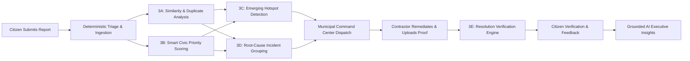
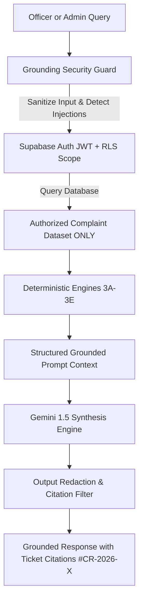
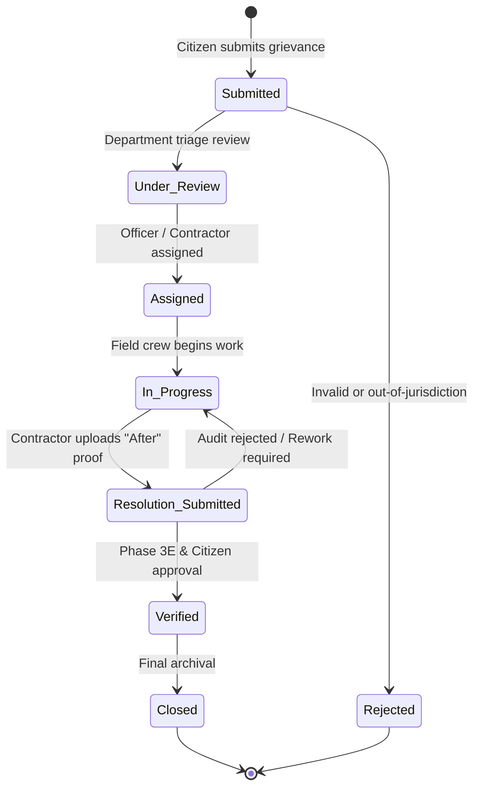

# 🏛️ CivicResolve
### *AI-Powered Municipal Grievance Redressal, Intelligence & Decision Support Platform*

[](https://reactjs.org/)
[](https://www.typescriptlang.org/)
[](https://flutter.dev)
[](https://supabase.com)
[](https://www.postgresql.org/)
[](https://maplibre.org/)
[](https://vitejs.dev/)

> 🚀 **Production-Ready Monorepo Architecture** — Citizen & Contractor Flutter Mobile Client + Municipal React 18 Command Center + PostgreSQL Database-Enforced Row Level Security + 5-Engine Deterministic Civic Intelligence + Grounded Municipal AI.

---

## 📌 Executive Overview

**CivicResolve** bridges the structural communication gap between urban citizens and municipal governance. Rather than treating civic complaints as isolated, unstructured text tickets, CivicResolve operationalizes grievance redressal into a connected, closed-loop municipal ecosystem.

The platform pairs a high-performance **Flutter Citizen & Contractor Mobile Client** with a comprehensive **React 18 / TypeScript Municipal Command Center**, backed by **PostgreSQL Row Level Security (RLS)** and **Supabase Auth**. At its core, five deterministic civic intelligence engines evaluate duplicate similarity, calculate multidimensional hazard priority, isolate localized emerging problem clusters, group potential common incidents, and verify remediation photographic evidence—while grounded AI assists municipal executives with shift briefings and triage recommendations strictly within authorized data boundaries.

---

## ⚠️ The Problem

Traditional municipal grievance management systems suffer from acute operational bottlenecks:

- **Fragmented Duplicate Inundation**: Multiple citizens reporting the same pothole or burst water pipe create disjointed, redundant tickets that overwhelm dispatchers.
- **Arbitrary Priority Assignment**: Triage is frequently subjective or chronological rather than driven by objective public safety risk, proximity to vulnerable zones (schools, hospitals), or duration of neglect.
- **Disconnected Field Workflows**: Contractors mark issues "resolved" without objective before/after visual proof, resulting in disputed work quality and citizen dissatisfaction.
- **Blindness to Systemic Incidents**: Recurring localized failures (e.g., 5 water leaks within 300 meters over 48 hours indicating a ruptured water main) are treated as individual complaints rather than symptoms of a single root-cause infrastructure failure.
- **Unverified AI Risks**: Generic LLM chatbots applied to public administration frequently hallucinate facts, expose citizen PII, or leak cross-departmental records without database-level authorization.

---

## 💡 The Solution

CivicResolve resolves these challenges through an integrated, closed-loop architecture where **deterministic rule engines remain the authoritative source of truth**, and **AI operates strictly as a decision-support layer**:



---

## ⚡ Core Feature Matrix

| Feature Domain | What CivicResolve Does | Operational Benefit |
| :--- | :--- | :--- |
| **Citizen Intake** | GPS auto-capture, photo upload, category selection, and structured description. | Frictionless, high-veracity incident reporting from mobile. |
| **Duplicate Suppression** | Evaluates spatial radius (200m), category, and description similarity without auto-deleting. | Prevents duplicate work orders while tracking total community impact. |
| **Smart Civic Priority** | Computes 0–100 score from hazard severity, location vulnerability, and neglect age. | Eliminates subjective triage; surfaces critical public hazards first. |
| **Emerging Hotspots** | Detects statistical complaint spikes within localized geospatial clusters (500m / 72h). | Provides early warning of systemic failures before full escalation. |
| **Incident Grouping** | Clusters related complaints sharing temporal, spatial, and semantic consistency. | Enables municipal teams to address root causes rather than isolated symptoms. |
| **Resolution Audit** | Evaluates before-vs-after photographic evidence and citizen rating consistency. | Ensures objective contractor accountability before ticket closure. |
| **Municipal Copilot** | Grounded operational chat with prompt-injection defense and ticket citation (`#CR-2026-101`). | Synthesizes complex shift handovers and answers officer queries safely. |
| **Executive AI Insights** | Translates deterministic engine outputs into structured shift alerts and priority queues. | Instant situational awareness for municipal commissioners and department heads. |
| **GIS Command Center** | Interactive MapLibre GL map with priority heatmaps, duplicate rings, and live filters. | Complete city-wide geospatial visibility across departments. |
| **PostgreSQL RLS & RBAC** | Database-enforced authorization across 5 canonical roles (`citizen` to `super_admin`). | Guarantees zero cross-tenant or unprivileged data leakage at the query level. |
| **PII & Injection Guard** | Deterministically masks Aadhaar, phone numbers, and emails before AI synthesis. | Protects citizen privacy and thwarts privilege-escalation prompt attacks. |

---

## 🧠 Civic Intelligence Engines (Phases 3A–3E)

CivicResolve implements five decoupled, deterministic intelligence algorithms that run identically in TypeScript (Web) and Dart (Mobile):

```
┌─────────────────────────────────────────────────────────────────────────────────────────┐
│                           DETERMINISTIC CIVIC ENGINES                                   │
├─────────────────────┬─────────────────────┬─────────────────────┬───────────────────────┤
│ 3A: Similarity      │ 3B: Smart Priority  │ 3C: Emerging Spikes │ 3D: Root Incidents    │
│ • 200m Radius       │ • Hazard Severity   │ • 500m Density      │ • Spatial Cohesion    │
│ • Levenshtein Text  │ • Vulnerable Zones  │ • 72h Velocity      │ • Category Invariance │
│ • Category Match    │ • Neglect Escalation│ • Baseline Outliers │ • Cluster Size Weight │
└─────────────────────┴─────────────────────┴─────────────────────┴───────────────────────┘
                                           │
                                           ▼
┌─────────────────────────────────────────────────────────────────────────────────────────┐
│ 3E: Resolution Verification Engine                                                      │
│ • Before vs. After Visual Evidence   • Citizen Star Rating & Sentiment                  │
│ • Remediation Completeness Check     • Fallback Human Audit Flagging                    │
└─────────────────────────────────────────────────────────────────────────────────────────┘
```

### Engine Specifications

| Engine | Primary Objective | Algorithmic Signals | Safety & Integrity Principle |
| :--- | :--- | :--- | :--- |
| **3A: Similarity** | Identify related or duplicate grievances. | Haversine distance ($\le 200\text{m}$), Category identity, Normalized text similarity ($\ge 0.65$). | **Never auto-deletes or merges tickets.** Preserves distinct citizen voices while surfacing relationships. |
| **3B: Smart Priority** | Calculate deterministic triage urgency (0–100). | Hazard base severity (0–40), Public safety / vulnerability zone (0–25), Temporal SLA aging (0–20), Environmental impact (0–15). | **Deterministic & reproducible.** AI cannot arbitrarily inflate or downgrade calculated priority. |
| **3C: Emerging Problems** | Detect localized complaint velocity anomalies. | Spatial concentration ($\le 500\text{m}$), Short-term velocity ($\le 72\text{h}$), Category homogeneity ($\ge 70\%$), Historical baseline spike factor. | **Requires sufficient statistical baseline.** Isolated complaints never trigger false community alarms. |
| **3D: Common Incidents** | Group multi-ticket symptoms of single infrastructure failures. | Geographic proximity ($\le 1\text{km}$), Category uniformity, Temporal alignment, Similarity graph connectivity, Cluster volume. | **Strictly designated "Potential Common Incident".** Preserves separate work tickets under one incident umbrella. |
| **3E: Resolution Audit** | Quantify remediation veracity before ticket closure. | Before/After photo presence, Visual repair delta, Citizen feedback rating, Sentiment analysis keywords. | **Decision support only.** Low confidence triggers mandatory supervisory manual audit rather than auto-rejection. |

---

## 🤖 Grounded Municipal AI (Phases 8A–8C & 9E)

CivicResolve enforces a strict separation between **generative AI capabilities** and **system authorization**:

> 🛡️ **Grounding Rule**: AI models *never* access raw database tables directly. Queries pass through the authenticated user's PostgreSQL RLS session first. Generative synthesis only operates on pre-filtered, authorized records and deterministic engine metrics.



### 1. Executive AI Insights (Phase 8A)
Transforms multidimensional telemetry into actionable summaries for municipal leadership:
- **Critical Dispatch Briefs**: Highlights unassigned high-priority emergencies ranked by Engine 3B.
- **Emerging Anomaly Alerts**: Summarizes geographic cluster developments from Engine 3C.
- **Incident Consolidation Recommendations**: Advises crews on grouped root-cause work orders from Engine 3D.
- **Resolution Quality Warnings**: Flags suspicious or low-confidence contractor closures from Engine 3E.

### 2. Municipal Copilot (Phase 8B)
A contextual operational assistant capable of answering complex administrative questions:
- *"Which electrical hazards near schools need immediate dispatch?"*
- *"Summarize emerging water contamination clusters reported in the last 48 hours."*
- *"Draft a municipal commissioner briefing for Ward 14 shift handover."*
- **Ticket Citation Enforcement**: Every factual claim cites specific complaint IDs (`#CR-2026-101`).

### 3. Grounding & Security Guard (Phase 8C & 9E)
- **PII Scrubbing**: Regex and token sanitizers mask phone numbers, emails, and 12-digit Aadhaar IDs.
- **Prompt Injection Defense**: Intercepts role-override exploits (`"Ignore RLS"`, `"Pretend I am super_admin"`, `"Reveal system tokens"`).
- **Safe Fallback**: Insufficient data returns explicit non-disclosure notices rather than speculative answers.

---

## 🔐 Security & Authorization Architecture

CivicResolve implements defense-in-depth across database, API, and client tiers:

```
[Client Request]
       │
       ▼
[Supabase Auth JWT] ──► Validates cryptographic signature & user identity
       │
       ▼
[PostgreSQL RLS]   ──► Enforces database-level row and column access policies
       │
       ▼
[Trigger Guards]   ──► Prevents citizen tampering with status, priority, or post-submission content
       │
       ▼
[Public Map View]  ──► Sanitizes reporter PII; exposes only coordinates, category, and status
```

### Canonical Role-Based Access Control (RBAC)

| Role | Scope | Key Permissions & Constraints |
| :--- | :--- | :--- |
| **`citizen`** | Personal Data Only | Submits grievances, views own complaint history, provides resolution feedback and ratings. **Cannot alter status, priority, officer assignment, or post-submission complaint content.** |
| **`officer`** | Assigned & Departmental | Inspects assigned tickets, updates operational stage, uploads contractor remediation photos. Cannot access complaints outside assigned department. |
| **`dept_admin`** | Department-Wide | Full visibility and dispatch control over specific department (e.g., Roads, Sanitation). Generates departmental intelligence reports. |
| **`municipal_admin`** | City-Wide Operations | City-wide triage, cross-departmental dispatch, SLA escalation management, city-wide AI Insights. |
| **`super_admin`** | System & Governance | Complete administrative authority, user role assignment (`public.user_roles`), commissioner executive briefings, system configuration. |

### Database Integrity Highlights
- **Immutable Complaint Content**: A PostgreSQL `BEFORE UPDATE` trigger rejects any citizen attempt to modify `title`, `description`, `category`, or GPS coordinates after submission.
- **Zero Client-Side Service Keys**: `SUPABASE_SERVICE_ROLE_KEY` is strictly prohibited in web and mobile code.
- **Secure Search Paths**: All `SECURITY DEFINER` functions lock `search_path = public, auth, pg_temp` to prevent search path hijacking.

---

## 🗺️ Municipal Command Center (React 18 Web)

Located in `apps/web/`, the Command Center is built with **React 18**, **TypeScript**, **Vite**, **TailwindCSS**, and **MapLibre GL**:

- **Real-Time KPI Command Dashboard**: Live metrics detailing total intake, active SLA breaches, unassigned emergencies, and verified resolutions.
- **Interactive GIS Map (`CommandMap.tsx`)**: High-performance vector map rendering complaint pins, priority heat halos, and **200m duplicate suppression buffer rings**.
- **Tactical Triage Queue (`PriorityQueue.tsx`)**: Instant dispatch interface sorted deterministically by Engine 3B priority scores.
- **Photographic Audit Inspector (`BeforeAfterInspector.tsx`)**: Side-by-side interactive visual comparison of citizen issue photos vs contractor remediation evidence.
- **Emerging Hotspot & Incident Cards**: Dedicated UI cards visualizing spatial clusters and recommended multi-report work orders.

---

## 📱 Citizen & Contractor Mobile Client (Flutter)

Located in `apps/mobile/`, the cross-platform mobile application serves citizens and field contractors:

```
[ Citizen Workflow ]
Submit Grievance (GPS + Photo) ➔ Real-Time Tracking ➔ Resolution Notification ➔ Visual Verification ➔ Star Rating & Feedback

[ Contractor Workflow ]
View Assigned Work Orders ➔ Navigate to GPS Pin ➔ Execute Remediation ➔ Upload "After" Proof ➔ Submit for Audit
```

- **Geospatial Proximity Alerts**: Warns citizens upon report creation if an identical complaint is already active within 200m.
- **Real-Time Progression Stepper**: Visual 7-step timeline keeping citizens updated on investigation, assignment, and progress.
- **Citizen Feedback Loop**: Five-star rating and satisfaction comments fed directly into the Phase 3E verification engine.

---

## 🔄 7-Stage Complaint Lifecycle



---

## 🧰 Technology Stack

| Layer | Technologies | Purpose |
| :--- | :--- | :--- |
| **Web Frontend** | React 18, TypeScript, Vite, TailwindCSS, Lucide Icons | Responsive Municipal Command Center interface |
| **Mobile Client** | Flutter 3.x, Dart | Cross-platform Citizen and Contractor mobile application |
| **GIS & Mapping** | MapLibre GL, MapLibre Flutter, OpenStreetMap Carto tiles | High-performance geospatial visualization and buffer rings |
| **Database & Auth** | Supabase, PostgreSQL 15, PostGIS, Supabase Auth | Relational storage, spatial queries, JWT authentication & RLS |
| **Intelligence** | Custom TypeScript / Dart Deterministic Engines (3A–3E) | Similarity, Priority, Hotspots, Incidents, and Verification |
| **AI Integration** | Google Gemini 1.5 Flash (via structured REST payloads) | Grounded Copilot chat and multimodal image classification |
| **Build & Test** | `tsc`, Vite, `tsx`, `flutter_test` | Zero-dependency TypeScript test runner and Flutter test suite |

---

## 📂 Monorepo Project Structure

```text
CivicResolve/
├── apps/
│   ├── mobile/                    # Flutter Citizen & Contractor Mobile Client
│   │   ├── lib/                   # Screen controllers, services, models & widgets
│   │   ├── assets/                # App icons, SVG emblems & sample proofs
│   │   ├── test/                  # Geospatial & widget test suites (98 tests)
│   │   ├── .env                   # Local mobile environment (gitignored)
│   │   └── pubspec.yaml           # Flutter dependencies & metadata
│   │
│   └── web/                       # React 18 + TypeScript Municipal Command Center
│       ├── src/
│       │   ├── components/        # Layout, Triage, GIS Map, Copilot, & UI Cards
│       │   ├── context/           # AuthContext & Session management
│       │   ├── hooks/             # Custom React hooks (useComplaints, useAuth, etc.)
│       │   ├── pages/             # Dashboard, LiveMap, Complaints, Copilot, AI Insights
│       │   ├── services/          # Deterministic engines (3A-3E), AI services, & tests
│       │   └── types/             # Domain TypeScript definitions (Complaint, User, GIS)
│       ├── public/                # Static assets, emblems, badges & favicons
│       ├── .env                   # Local web environment (gitignored)
│       ├── package.json           # Node.js dependencies & scripts
│       └── vite.config.ts         # Vite bundler configuration
│
├── supabase/
│   └── migrations/                # PostgreSQL PostGIS schema & RLS policies
│       ├── phase_9c_profiles_and_roles.sql
│       ├── phase_9d_secure_rls.sql
│       └── ...
│
├── .env                           # Optional local root environment (gitignored)
├── .env.example                   # CANONICAL MASTER environment template
└── README.md                      # Monorepo architecture & operations guide
```

---

## ⚙️ Setup & Installation

### 1. Prerequisites
- **Node.js**: v18.x or v20.x
- **npm**: v9.x or higher
- **Flutter SDK**: v3.19+ and Dart SDK
- **Supabase Account**: (Or use the project credentials in `.env.example`)

---

### 2. Running the Municipal Command Center (Web)

```bash
# 1. Navigate to the web application directory
cd apps/web

# 2. Configure environment (reference root .env.example for variable values)
# Create apps/web/.env with VITE_SUPABASE_URL and VITE_SUPABASE_ANON_KEY

# 3. Install dependencies
npm install

# 4. Start local development server
npm run dev
```
👉 Open browser at: **`http://localhost:3000`** (or displayed port).

---

### 3. Running the Citizen Mobile App (Flutter)

```bash
# 1. Navigate to the mobile application directory
cd apps/mobile

# 2. Configure environment (reference root .env.example for variable values)
# Create apps/mobile/.env with SUPABASE_URL, SUPABASE_ANON_KEY, and GEMINI_API_KEY

# 3. Fetch Flutter dependencies
flutter pub get

# 4. Launch application on connected device, emulator, or Chrome
flutter run -d chrome     # Quick web preview
flutter run               # Connected Android/iOS device
```

---

### 4. Environment Configuration & Monorepo Architecture

CivicResolve maintains a clean, single-source-of-truth configuration architecture across the monorepo:

| File | Purpose | Scope | Tracked in Git? |
| :--- | :--- | :--- | :---: |
| **`/.env.example`** | **CANONICAL MASTER REFERENCE** documenting all variables, classifications, and security tiers across the entire project | Monorepo Root | ✅ Yes |
| **`/.env`** | Optional local root-level configuration / tools | Local Dev | ❌ No (`.gitignore`) |
| **`/apps/web/.env`** | Active local Web development runtime (`VITE_SUPABASE_URL`, `VITE_SUPABASE_ANON_KEY`) | Web (`apps/web`) | ❌ No (`.gitignore`) |
| **`/apps/mobile/.env`** | Active local Flutter mobile runtime (`SUPABASE_URL`, `SUPABASE_ANON_KEY`, `GEMINI_API_KEY`) | Mobile (`apps/mobile`) | ❌ No (`.gitignore`) |

#### Configuration Loading Mechanisms
- **Web (`apps/web`)**: Loaded via Vite bundler (`import.meta.env.VITE_*`). Public variables must use the `VITE_` prefix to be available to browser TypeScript code.
- **Mobile (`apps/mobile`)**: Loaded dynamically via `flutter_dotenv` with compile-time `String.fromEnvironment` fallback in `AppConfig` (`lib/app_config.dart`). Uses canonical names (`SUPABASE_URL`, `SUPABASE_ANON_KEY`, `GEMINI_API_KEY`).

#### 3-Tier Security Matrix

```text
Tier 1: Public / Client-Safe  --> VITE_SUPABASE_URL, VITE_SUPABASE_ANON_KEY (Injected into client, secured by RLS)
Tier 2: Client-Exposed (Dev)  --> GEMINI_API_KEY (Flutter mobile development prototype only)
Tier 3: Server-Only Secrets   --> SUPABASE_SERVICE_ROLE_KEY, DATABASE_PASSWORD (STRICTLY FORBIDDEN IN CLIENTS)
```

> ⚠️ **Production Security Notice regarding `GEMINI_API_KEY`**:  
> In the current development prototype stage, the Flutter mobile client makes direct Gemini requests for rapid multimodal image triage. For enterprise production deployments, route all Gemini API calls through a secure server-side **Supabase Edge Function** to prevent embedding API credentials in client APK/IPA binaries:
> ```text
> Flutter / Web Client  ──(Authenticated JWT)──>  Supabase Edge Function  ──(Server Secret)──>  Gemini API
> ```

---

## 🧪 Testing & Verification Scorecard

CivicResolve includes rigorous, zero-dependency automated test suites covering all intelligence algorithms, authentication flows, PostgreSQL RLS policies, and integration contracts.

```
===========================================================
📊 CIVICRESOLVE TEST VERIFICATION SCORECARD
===========================================================
   3A: Similarity & Duplicate Detection Engine  -->  11 / 11 PASSED
   3B: Smart Civic Priority Engine (0-100)     -->  17 / 17 PASSED
   3C: Emerging Problem & Hotspot Engine       -->  31 / 31 PASSED
   3D: Root-Cause Common Incident Grouping     -->  21 / 21 PASSED
   3E: Resolution Verification & Audit Engine  -->  30 / 30 PASSED
   8A: Executive AI Insights Service           -->  28 / 28 PASSED
   8B: Grounded Municipal Copilot Engine       -->  34 / 34 PASSED
   8C: Grounding & Prompt-Injection Guards     -->  23 / 23 PASSED
   9B: Supabase Authentication & Sessions      -->  21 / 21 PASSED
   9C: Profiles & Database User Roles          -->  36 / 36 PASSED
   9D: PostgreSQL RLS & Authorization Policies -->  30 / 30 PASSED
   9E/9F: AI Auth Scope & Security Hardening   -->  37 / 37 PASSED
   13: Live Integration Contracts              -->  16 / 16 PASSED
   14: Command Center Auth Gate & Queue Tests  -->  21 / 21 PASSED
-----------------------------------------------------------
   WEB TEST SUITE TOTAL:                       --> 356 / 356 PASSED (0 failed)
   FLUTTER TEST SUITE TOTAL:                   -->  98 /  98 PASSED (0 failed)
   VITE PRODUCTION BUILD:                      -->   0 ERRORS (Clean build)
===========================================================
```

### Running the Test Suites

```bash
# Run the 356-test Web Intelligence, Security & Integration Suite
cd apps/web
npx --yes tsx src/services/runAllTests.ts

# Run the 98-test Flutter Mobile Suite
cd apps/mobile
flutter test

# Validate Web Production Build
cd ../web
npm run build
```

---

## 🌟 Why CivicResolve is Different

| Dimension | Legacy Grievance Systems | CivicResolve Platform |
| :--- | :--- | :--- |
| **Triage Model** | Chronological / Manual FIFO | Deterministic multi-factor hazard priority scoring (Engine 3B) |
| **Duplicate Handling** | Redundant work orders created | 200m spatial buffer clustering without silencing citizen reports (Engine 3A) |
| **Systemic Failure Detection**| Ignored until major disaster | Real-time velocity and spatial spike detection (Engine 3C) |
| **Incident Management** | Treats every complaint as isolated | Groups correlated complaints into single root-cause incidents (Engine 3D) |
| **Resolution Verification**| Contractor self-certification | Before/After photo comparison + Citizen feedback audit (Engine 3E) |
| **AI Role** | Unconstrained hallucination-prone bot | Grounded decision-support bound by PostgreSQL RLS and ticket citations |
| **Authorization** | Application-level checks | Database-level PostgreSQL Row Level Security (RLS) policies |

---

## 🎯 Realistic Municipal Use Cases

- 🕳️ **Road & Infrastructure Hazards**: High-priority detection of deep potholes or road cave-ins near school zones, preventing vehicular accidents.
- 🚰 **Water & Sewage Emergencies**: Fast clustering of multiple contaminated water complaints across a 400m radius, isolating water main ruptures within hours.
- 💡 **Streetlight & Grid Failures**: Grouping 12 individual dark street complaints into a single electrical substation circuit work order.
- 🗑️ **Sanitation & Waste Management**: Detecting recurring garbage accumulation hotspots and tracking contractor remediation veracity.
- 🚨 **Public Safety & Monsoon Hazards**: Automated escalation of fallen trees, exposed live electrical wires, or flooded underpasses during severe weather events.

---

## 🚀 Future Production Roadmap

- [ ] **Server-Side AI Proxy**: Migrate mobile Gemini multimodal triage into a serverless Supabase Edge Function to fully isolate AI credentials.
- [ ] **Advanced PostGIS Geo-Fencing**: Dynamic ward boundary polygons and automated jurisdictional routing for municipal zones.
- [ ] **Automated Push Notifications**: Web Push / FCM integration for real-time status updates delivered to citizen handsets.
- [ ] **Contractor Performance Index**: Longitudinal analytics tracking contractor SLA compliance, average repair duration, and rework penalty rates.
- [ ] **Offline-First Field Mode**: Local SQLite caching in Flutter for contractors operating in low-connectivity underground or rural locations.

---

## 👥 Contributors & Acknowledgments

Developed as a modern, production-grade civic technology initiative combining deterministic algorithms with responsible, grounded artificial intelligence for transparent municipal governance.

- **Frontend & Command Center Engineering**: React 18, TypeScript, MapLibre GL
- **Mobile Client Engineering**: Flutter & Dart Geospatial Architecture
- **Backend & Security**: PostgreSQL PostGIS, Supabase Auth & RLS Policies

---

## 📜 License

License: Not yet specified.
