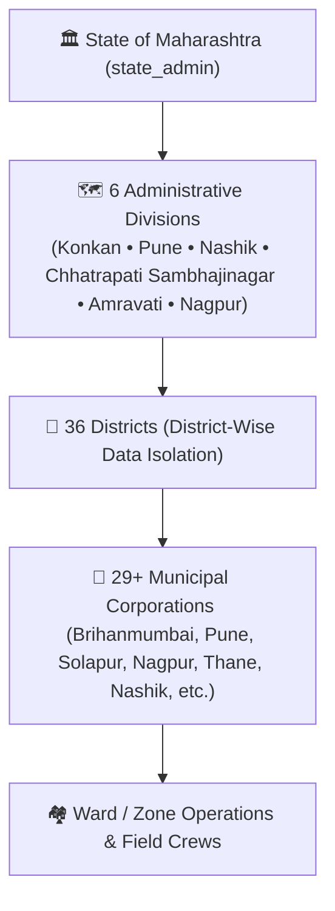
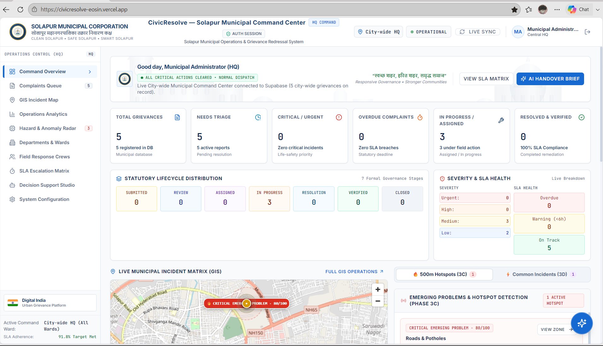
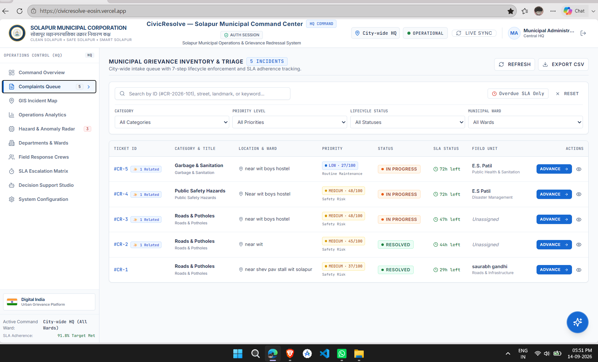
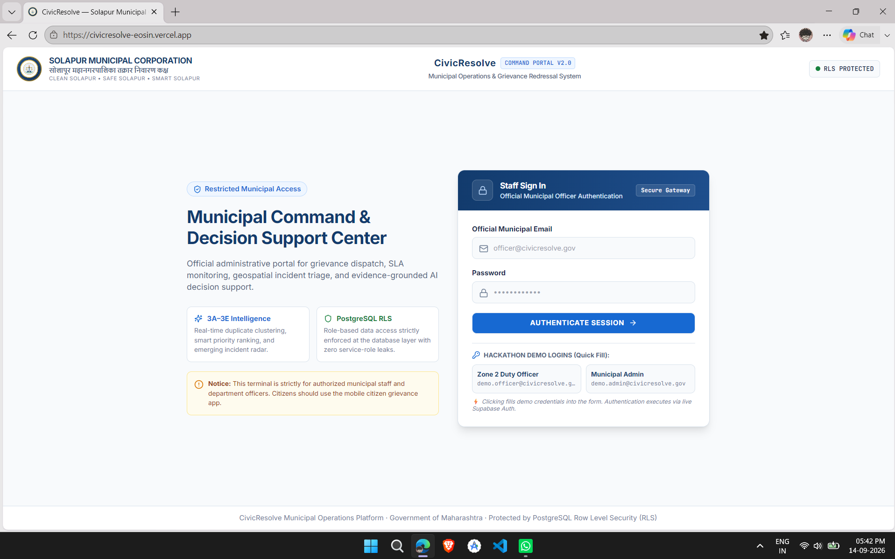
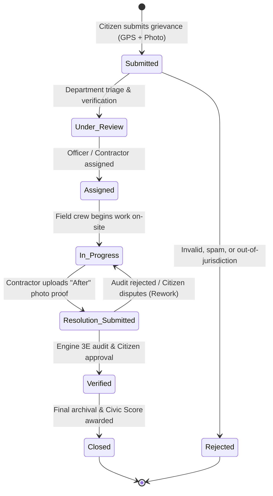
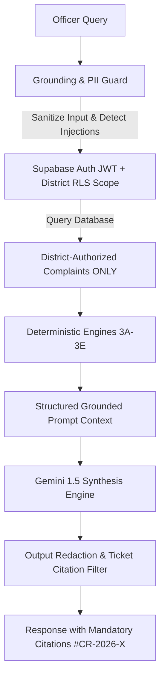

# 🏛️ CivicResolve
### *AI-Powered Municipal Grievance Redressal, Geospatial Intelligence & Decision Support Platform*

[](https://civicresolve2.vercel.app/))
[](https://drive.google.com/drive/folders/1azDqGXinzO9kAdOr8b1ohYQV0zbtmmGa?usp=sharing)
[](https://www.youtube.com/watch?v=FCalhhiW2ds)
[](https://docs.google.com/spreadsheets/d/1dCCleNU2lp0RIOz0-KM4JaEw3maJnhjTvF5sVgw2CgE/edit?gid=310055827#gid=310055827)

[](https://reactjs.org/)
[](https://www.typescriptlang.org/)
[](https://flutter.dev)
[](https://supabase.com)
[](https://www.postgresql.org/)
[](https://maplibre.org/)
[](https://vitejs.dev/)
[](#-testing--verification-scorecard)

> 🚀 **Production-Ready Monorepo Architecture** — State & Municipal Operations Command Center (React 18 Web) + Citizen & Field Officer Client (Flutter Mobile) + PostgreSQL PostGIS Database-Enforced Row Level Security + 5 Deterministic Civic Intelligence Engines + Grounded Municipal AI Copilot.

---

## 🔗 Live Access & Project Artifacts

| Resource | Link | Description |
|:---|:---|:---|
| 🌐 **Live Web Command Center** | **[CivicResolve — Maharashtra Municipal Command Center](https://civicresolve-eosin.vercel.app/)** | Executive Command Center & Zone Operations dashboard deployed on Vercel |
| 📱 **Android Release APK** | **[Download APK (Google Drive)](https://drive.google.com/drive/folders/1azDqGXinzO9kAdOr8b1ohYQV0zbtmmGa?usp=sharing)** | Direct download link for the compiled production-ready Flutter release APK |
| 📺 **Video Demonstration** | **[Demonstration Video — Civic Resolve](https://www.youtube.com/watch?v=FCalhhiW2ds)** | Complete video walkthrough of citizen mobile reporting, GIS command map, and municipal triage |
| 📊 **Citizen Feedback & Survey** | **[Civic Issue Reporting System Feedback (Responses)](https://docs.google.com/spreadsheets/d/1dCCleNU2lp0RIOz0-KM4JaEw3maJnhjTvF5sVgw2CgE/edit?gid=310055827#gid=310055827)** | Verified citizen feedback collected during field user testing across municipal wards |

---

## 📚 Table of Contents & Quick Navigation

- [📌 Executive Overview](#-executive-overview)
- [🏛️ Maharashtra Administrative Hierarchy & Platform Scope](#️-maharashtra-administrative-hierarchy--platform-scope)
- [📸 Interface & Visual Feature Tour](#-interface--visual-feature-tour)
- [⚡ Core Platform Capabilities](#-core-platform-capabilities)
- [🧠 5 Deterministic Civic Intelligence Engines (Phases 3A–3E)](#-5-deterministic-civic-intelligence-engines-phases-3a3e)
- [🔄 7-Stage Complaint Lifecycle & Resolution Flow](#-7-stage-complaint-lifecycle--resolution-flow)
- [⏱️ Statutory SLA Management & Smart Alerts](#️-statutory-sla-management--smart-alerts)
- [🔍 Before/After Resolution Verification Engine](#-beforeafter-resolution-verification-engine)
- [🏆 Citizen Civic Score & Civic Champions](#-citizen-civic-score--civic-champions)
- [📢 Multi-Channel Notification Engine](#-multi-channel-notification-engine)
- [🤖 Grounded Municipal AI Copilot & Decision Support](#-grounded-municipal-ai-copilot--decision-support)
- [🔐 Security Architecture & PostgreSQL RLS](#-security-architecture--postgresql-rls)
- [🧰 Technology Stack](#-technology-stack)
- [📂 Monorepo Project Structure](#-monorepo-project-structure)
- [⚙️ Setup & Local Execution Guide](#️-setup--local-execution-guide)
- [🧪 Testing & Verification Scorecard](#-testing--verification-scorecard)
- [🌟 Why CivicResolve is Different](#-why-civicresolve-is-different)
- [🎯 Realistic Municipal Use Cases](#-realistic-municipal-use-cases)
- [📖 Dedicated Technical Documentation](#-dedicated-technical-documentation)

---

## 📌 Executive Overview

**CivicResolve** transforms municipal public works and grievance management from a reactive, fragmented ticket-logging system into an intelligent, closed-loop urban governance platform. 

Operating across **Maharashtra's 6 Administrative Divisions, 36 Districts, and 29+ Municipal Corporations**, CivicResolve unites state administrators, municipal commissioners, ward officers, field contractors, and urban citizens into a synchronized operational pipeline.

The platform pairs a high-performance **Flutter Mobile Application** for citizens and field officers with an executive **React 18 / TypeScript Municipal Command Center** for municipal and state administrators, backed by **PostgreSQL Row Level Security (RLS)**, **PostGIS**, and **Supabase Auth**.

At its core, **5 decoupled deterministic intelligence engines** manage duplicate suppression, multi-factor hazard priority scoring, localized emerging hotspot detection, root-cause incident clustering, and photographic before/after resolution verification—while a **grounded AI Copilot** provides real-time shift briefings and tactical decision support strictly within authorized database boundaries.

---

## 🏛️ Maharashtra Administrative Hierarchy & Platform Scope

CivicResolve models the exact administrative governance hierarchy of the State of Maharashtra:


```mermaid
flowchart TD
    State["🏛️ State of Maharashtra (state_admin)"]
    Divisions["🗺️ 6 Administrative Divisions<br/>(Konkan • Pune • Nashik • Chhatrapati Sambhajinagar • Amravati • Nagpur)"]
    Districts["📍 36 Districts (District-Wise Data Isolation)"]
    ULBs["🏢 29+ Municipal Corporations (Brihanmumbai, Pune, Solapur, Nagpur, Thane, Nashik, etc.)"]
    Wards["🏘️ Ward / Zone Operations & Field Crews"]

    State --> Divisions
    Divisions --> Districts
    Districts --> ULBs
    ULBs --> Wards
```

### Dedicated Platform Role Boundaries

| Platform Interface | Target Roles | Key Capabilities & Boundary Rules |
| :--- | :--- | :--- |
| **Municipal Command Center**<br/>*(React 18 + TypeScript Web)* | `state_admin`<br/>`municipal_admin`<br/>`dept_admin`<br/>`officer` | • Executive KPI dashboards, live GIS command map, and 7-stage triage queue.<br/>• **State Admin**: Cross-district visibility with statewide district switcher.<br/>• **Municipal & Dept Admin**: Strict district and departmental data isolation.<br/>• **SLA Tracking**: Real-time breach alerts, countdown timers, and escalation triggers.<br/>• **Before/After Inspector**: Visual audit tool for contractor remediation proof.<br/>• 🔒 *No citizen portal on the web to maintain strict operational security.* |
| **Citizen & Field App**<br/>*(Flutter Cross-Platform Mobile)* | `citizen`<br/>`officer` | • **Citizen Intake**: Live GPS auto-capture, camera proof, and category tagging.<br/>• **200m Duplicate Discovery**: Proximity detection and citizen upvoting.<br/>• **Live Tracking**: 7-stage real-time progression stepper & push updates.<br/>• **Civic Recognition**: Civic Score, digital certificates, and nursery sapling vouchers.<br/>• **Field Officer Mode**: GPS navigation to incident, work execution, and "After" photo upload. |

---

## 📸 Interface & Visual Feature Tour

### 🏛️ Municipal & State Command Center (React 18 Web)

<div align="center">

| Executive Command Dashboard & GIS Telemetry | 7-Stage Complaints Management & Triage Queue |
|:---:|:---:|
|  |  |

| Municipal Authentication & District Selector | Grounded AI Municipal Copilot Drawer |
|:---:|:---:|
|  |  |

| GIS Geospatial Intelligence & Incident Clusters | Before / After Resolution Verification Audit |
|:---:|:---:|
|  |  |

</div>

### 📱 Citizen & Field Officer Mobile Experience (Flutter)

<div align="center">

| Citizen Grievance Intake & GPS Tagging | 200m Duplicate Discovery & Citizen Upvote | AI Multi-Hazard Detection & Triage |
|:---:|:---:|:---:|
|  |  |  |

</div>

---

## ⚡ Core Platform Capabilities

| Capability Domain | What CivicResolve Does | Operational Impact |
| :--- | :--- | :--- |
| **Intelligent Citizen Intake** | Auto-captures high-accuracy GPS coordinates, camera photo evidence, and structured grievance taxonomy. | Eliminates vague reports; provides exact actionable field locations. |
| **200m Duplicate Suppression** | Evaluates spatial radius ($\le 200\text{m}$), category, and semantic similarity to surface parent complaints. | Prevents duplicate work orders while aggregating citizen upvotes for community impact. |
| **Smart Civic Priority (0–100)** | Computes deterministic priority using hazard severity, school/hospital zone vulnerability, and SLA age. | Eliminates subjective triage; surfaces critical public safety emergencies first. |
| **Emerging Hotspot Detection** | Identifies localized complaint spikes ($\le 500\text{m}$ / $72\text{h}$) exceeding historical baselines. | Provides early warning of systemic infrastructure failures before full escalation. |
| **Root-Cause Incident Grouping** | Clusters related complaints into unified "Potential Common Incidents" ($\le 1\text{km}$). | Enables crews to repair root causes (e.g., water main burst) instead of symptoms. |
| **Before/After Resolution Audit** | Evaluates visual delta between initial complaint and contractor remediation photos. | Prevents fraudulent closures; enforces contractor accountability. |
| **Grounded AI Copilot** | Natural language operational assistant citing real ticket IDs (`#CR-2026-X`) with PII redaction. | Synthesizes shift handovers and answers officer queries safely within RLS boundaries. |
| **Statutory SLA & Escalation** | 4-tier countdown clocks (Critical 4h, High 12h, Medium 48h, Low 72h) with automatic escalation. | Guarantees compliance with citizen charter timelines and municipal service mandates. |
| **Multi-Channel Notifications** | Push notifications, SMS/WhatsApp templates, in-app alerts, and officer dispatch broadcasts. | Keeps citizens and field crews synchronized at every lifecycle transition. |
| **PostgreSQL RLS & RBAC** | Database-enforced Row Level Security across 5 canonical roles (`citizen` to `super_admin`). | Guarantees zero cross-district or unprivileged data leakage at the query level. |

---

## 🧠 5 Deterministic Civic Intelligence Engines (Phases 3A–3E)

CivicResolve implements 5 mathematical, deterministic intelligence algorithms that run identically in TypeScript (Web) and Dart (Mobile):

```
┌─────────────────────────────────────────────────────────────────────────────────────────┐
│                           DETERMINISTIC CIVIC ENGINES                                   │
├─────────────────────┬─────────────────────┬─────────────────────┬───────────────────────┤
│ 3A: Similarity      │ 3B: Smart Priority  │ 3C: Emerging Spikes │ 3D: Root Incidents    │
│ • 200m Radius       │ • Hazard Severity   │ • 500m Density      │ • Spatial Cohesion    │
│ • Levenshtein Text  │ • Vulnerable Zones  │ • 72h Velocity      │ • Category Invariance │
│ • Category Match    │ • Neglect Escalation│ • Baseline Outliers │ • Cluster Size Weight │
└─────────────────────┴─────────────────────┴─────────────────────┴───────────────────────┘
                                           │
                                           ▼
┌─────────────────────────────────────────────────────────────────────────────────────────┐
│ 3E: Resolution Verification Engine                                                      │
│ • Before vs. After Visual Evidence   • Citizen Star Rating & Sentiment                  │
│ • Remediation Completeness Check     • Fallback Human Audit Flagging                    │
└─────────────────────────────────────────────────────────────────────────────────────────┘
```

### Engine Specifications

| Engine | Primary Function | Algorithmic Formulation & Signals | Safety & Governance Rule |
| :--- | :--- | :--- | :--- |
| **3A: Similarity & Duplicate** | Identifies existing active complaints nearby. | $\text{Distance} \le 200\text{m}$, $\text{Category Match} = \text{true}$, $\text{Levenshtein Similarity} \ge 0.65$. | **Never auto-deletes tickets.** Preserves distinct citizen records while linking them to the parent issue for upvoting. |
| **3B: Smart Civic Priority** | Computes objective triage urgency ($0\text{--}100$). | $\text{Score} = \text{Hazard Severity (40)} + \text{Zone Vulnerability (25)} + \text{SLA Age (20)} + \text{Community Upvotes (15)}$. | **Deterministic & reproducible.** AI models cannot arbitrarily override calculated priority. |
| **3C: Emerging Hotspots** | Detects statistical complaint velocity spikes. | Spatial radius $\le 500\text{m}$, Time window $\le 72\text{h}$, Category homogeneity $\ge 70\%$, Baseline spike factor $> 2.5\times$. | **Requires statistical baseline.** Isolated grievances never trigger false alarms. |
| **3D: Common Incidents** | Clusters multi-ticket symptoms of root failures. | Geospatial proximity $\le 1\text{km}$, Category consistency, Temporal alignment, Similarity graph connectivity. | **Labeled "Potential Common Incident".** Preserves individual citizen tickets under a single incident umbrella. |
| **3E: Resolution Audit** | Quantifies repair veracity before ticket closure. | Dual photo presence, Visual repair delta, GPS match ($\le 50\text{m}$), Citizen 5-star rating and satisfaction sentiment. | **Decision support only.** Low confidence triggers mandatory supervisory review instead of auto-rejection. |

---

## 🔄 7-Stage Complaint Lifecycle & Resolution Flow


```mermaid
stateDiagram-v2
    [*] --> Submitted: Citizen submits grievance (GPS + Photo)
    Submitted --> Under_Review: Department triage & verification
    Submitted --> Rejected: Invalid, spam, or out-of-jurisdiction
    Under_Review --> Assigned: Officer / Contractor assigned
    Assigned --> In_Progress: Field crew begins work on-site
    In_Progress --> Resolution_Submitted: Contractor uploads "After" photo proof
    Resolution_Submitted --> Verified: Engine 3E audit & Citizen approval
    Resolution_Submitted --> In_Progress: Audit rejected / Citizen disputes (Rework)
    Verified --> Closed: Final archival & Civic Score awarded
    Closed --> [*]
    Rejected --> [*]
```

---

## ⏱️ Statutory SLA Management & Smart Alerts

CivicResolve implements statutory Service Level Agreement (SLA) timelines based on municipal charter guidelines:

| Priority Tier | Initial SLA Window | Auto-Escalation Threshold | Color Indicator | Target Incidents |
| :--- | :---: | :---: | :---: | :--- |
| **CRITICAL** | **4 Hours** | After 2 Hours (50% elapsed) | 🔴 Red Pulsing | Exposed live wires, major water main bursts, road cave-ins |
| **HIGH** | **12 Hours** | After 6 Hours (50% elapsed) | 🟠 Amber | Deep potholes on arterial roads, sewage overflow near schools |
| **MEDIUM** | **48 Hours** | After 24 Hours (50% elapsed) | 🟡 Yellow | Non-functioning streetlights, uncollected garbage, park maintenance |
| **LOW** | **72 Hours** | After 48 Hours (66% elapsed) | 🟢 Green | Tree pruning, minor signage damage, cosmetic repairs |

### Smart Alert Matrix
- 🚨 **SLA Breach Warning**: Triggered when remaining time drops below 25%.
- ⚠️ **SLA Overdue Alert**: Triggered immediately upon breach; escalates to Municipal Commissioner / Dept Admin.
- 🔥 **Hotspot Surge Alert**: Triggered when Engine 3C detects $\ge 5$ complaints in 500m over 24 hours.
- 🔄 **Citizen Dispute Alert**: Triggered when citizen rejects contractor resolution proof and requests rework.

---

## 🔍 Before/After Resolution Verification Engine

To eliminate disputed contractor work orders, CivicResolve mandates photographic resolution verification:

1. **Before Photo (Intake)**: Captured by citizen via mobile camera with tamper-resistant GPS coordinates and timestamp.
2. **Field Execution**: Assigned contractor navigates to GPS pin and completes physical remediation.
3. **After Photo (Resolution)**: Contractor captures proof photo at the exact site ($\le 50\text{m}$ proximity check).
4. **Visual Comparison Inspector (`BeforeAfterInspector.tsx`)**: Municipal officers inspect high-resolution side-by-side images with interactive comparison sliders.
5. **Citizen Verification**: Citizen receives push notification with the "After" proof to approve or request rework.

---

## 🏆 Citizen Civic Score & Civic Champions

CivicResolve incentivizes authentic civic participation through a transparent, gamified recognition framework:

| Action | Civic Score Points | Purpose |
| :--- | :---: | :--- |
| **Verified Grievance Submission** | `+10 Points` | Awarded upon successful resolution and verification of a valid complaint. |
| **200m Duplicate Upvote** | `+5 Points` | Incentivizes upvoting existing issues rather than filing redundant tickets. |
| **Resolution Feedback & Rating** | `+15 Points` | Encourages citizens to review and confirm contractor work quality. |
| **Spam / Fraudulent Submission** | `-25 Points` | Deters false reports, fabricated photos, and platform abuse. |

### Civic Champion Tiers & Digital Recognition
- 🥉 **Civic Sentinel** (0–99 pts): Active neighborhood contributor.
- 🥈 **Community Guardian** (100–249 pts): Verified local civic leader.
- 🥇 **Urban Champion** (250+ pts): High-veracity citizen eligible for official municipal digital recognition certificates and municipal nursery sapling redemption vouchers on civic occasions (Gandhi Jayanti, Republic Day, Independence Day).

---

## 📢 Multi-Channel Notification Engine

CivicResolve keeps all stakeholders synchronized across every stage of the grievance lifecycle:

| Channel | Recipient | Trigger Events | Content |
| :--- | :--- | :--- | :--- |
| **In-App Notification Center** | Citizen / Officer | Status changes, officer assignments, resolution ready | Real-time badge counter, deep link to ticket timeline. |
| **Web Push (VAPID)** | Municipal Admin / Officer | Emergency SLA breach, new critical intake, hotspot spike | Desktop notification banner with instant action button. |
| **SMS / WhatsApp Gateway** | Citizen | Grievance filed, assigned, resolved, satisfaction survey | Structured Marathi/Hindi/English templates with tracking URL. |
| **Officer Escalation Dispatch** | Field Contractor | Work order assigned, SLA warning, dispute reopen | Direct job card details with navigation link. |

---

## 🤖 Grounded Municipal AI Copilot & Decision Support

CivicResolve enforces a strict separation between **generative AI capabilities** and **system authorization**:

> 🛡️ **Grounding Principle**: AI models *never* query database tables directly. All queries pass through the authenticated user's PostgreSQL RLS session. Generative synthesis only operates on pre-filtered, authorized datasets and deterministic engine outputs.


```mermaid
flowchart TD
    UserQuery[Officer Query] --> SecGuard[Grounding & PII Guard]
    SecGuard -->|Sanitize Input & Detect Injections| AuthContext[Supabase Auth JWT + District RLS Scope]
    AuthContext -->|Query Database| AuthData[District-Authorized Complaints ONLY]
    AuthData --> DetEngines[Deterministic Engines 3A-3E]
    DetEngines --> AIContext[Structured Grounded Prompt Context]
    AIContext --> LLM[Gemini 1.5 Synthesis Engine]
    LLM --> OutGuard[Output Redaction & Ticket Citation Filter]
    OutGuard --> FinalResponse[Response with Mandatory Citations #CR-2026-X]
```

- **Executive AI Insights**: Generates structured shift handovers, unassigned emergency summaries, and contractor quality alerts for department heads.
- **Interactive Municipal Copilot**: Answers complex queries (e.g., *"Summarize unassigned water contamination reports in Ward 4"*).
- **Mandatory Ticket Citations**: Every claim must reference active ticket numbers (`#CR-2026-101`).
- **PII Scrubbing**: Automatically redacts citizen phone numbers, emails, and 12-digit Aadhaar numbers before prompt ingestion.
- **Prompt Injection Defense**: Thwarts privilege escalation attacks (`"Ignore RLS"`, `"Pretend I am super_admin"`).

---

## 🔐 Security Architecture & PostgreSQL RLS

CivicResolve implements defense-in-depth across database, API, and client tiers:

```
[Client Request]
       │
       ▼
[Supabase Auth JWT] ──► Validates cryptographic signature & user identity
       │
       ▼
[PostgreSQL RLS]   ──► Enforces database-level row and column access policies
       │
       ▼
[Trigger Guards]   ──► Prevents tampering with status, priority, or post-submission content
       │
       ▼
[Public Map View]  ──► Sanitizes reporter PII; exposes only coordinates, category, and status
```

### Role-Based Access Control (RBAC) Matrix

| Role | Scope | Key Permissions & Constraints |
| :--- | :--- | :--- |
| **`citizen`** | Personal Data Only | Submits complaints, views own grievance history, provides satisfaction feedback and ratings. **Cannot alter status, priority, officer assignment, or post-submission complaint content.** |
| **`officer`** | Assigned District & Department | Inspects assigned tickets, updates operational progress, uploads contractor remediation photos. Cannot access complaints outside assigned district/department. |
| **`dept_admin`** | Department-Wide (District) | Full dispatch and triage control over specific department (e.g., Roads, Water Supply) within assigned district. |
| **`municipal_admin`** | Municipal Corporation (District) | City-wide triage, cross-departmental dispatch, SLA escalation management, district-wide AI Insights. |
| **`state_admin`** | Statewide (All 36 Districts) | Complete statewide oversight, inter-district performance analytics, state-level policy dashboards, and district switching. |

---

## 🧰 Technology Stack

| Layer | Technologies | Purpose |
| :--- | :--- | :--- |
| **Web Frontend** | React 18.3, TypeScript 5.5, Vite 6.x, TailwindCSS, Lucide Icons | Responsive Municipal Command Center interface |
| **Mobile Client** | Flutter 3.x, Dart | Cross-platform Citizen and Field Officer mobile application |
| **GIS & Mapping** | MapLibre GL 4.7, MapLibre Flutter, OpenStreetMap Carto tiles | High-performance geospatial visualization and 200m buffer rings |
| **Database & Auth** | Supabase, PostgreSQL 15, PostGIS, Supabase Auth | Relational storage, spatial queries, JWT authentication & RLS |
| **Intelligence** | Custom TypeScript / Dart Deterministic Engines (3A–3E) | Similarity, Priority, Hotspots, Incidents, and Verification |
| **AI Integration** | Google Gemini 1.5 Flash (via structured REST payloads) | Grounded Copilot chat and multimodal image classification |
| **Build & Test** | `tsc`, Vite, `tsx`, `flutter_test` | Zero-dependency TypeScript test runner and Flutter test suite |

---

## 📂 Monorepo Project Structure

```text
CIVICRESOLVE/
├── apps/
│   ├── mobile/                    # Flutter Citizen & Field Officer Mobile Client
│   │   ├── lib/                   # Screen controllers, services, models & widgets
│   │   │   ├── models/            # Grievance, CivicScore, User profile models
│   │   │   ├── screens/           # Reporting, Tracking, DuplicateUpvote, OfficerMode
│   │   │   └── services/          # Supabase, Location, AI detection, & Storage
│   │   ├── assets/                # App icons, SVG emblems & sample proofs
│   │   ├── test/                  # Geospatial & widget test suites
│   │   └── pubspec.yaml           # Flutter dependencies & metadata
│   │
│   └── web/                       # React 18 + TypeScript Municipal Command Center
│       ├── src/
│       │   ├── components/        # Triage, GIS Map, Copilot, BeforeAfterInspector
│       │   ├── context/           # AuthContext & Session management
│       │   ├── hooks/             # useComplaints, useAuth, useSmartAlerts
│       │   ├── pages/             # Dashboard, LiveMap, Complaints, Copilot, CivicChampions
│       │   ├── services/          # Deterministic engines (3A-3E), AI services, & tests
│       │   └── types/             # Domain TypeScript definitions (Complaint, User, GIS)
│       ├── public/                # Static assets, emblems, badges & favicons
│       ├── package.json           # Node.js dependencies & scripts
│       ├── vercel.json            # Vercel SPA routing configuration
│       └── vite.config.ts         # Vite bundler configuration
│
├── docs/                          # Comprehensive technical reference documentation
│   ├── ARCHITECTURE.md            # System architecture & component maps
│   ├── AI-INTELLIGENCE.md         # 3A–3E mathematical specifications & Copilot
│   ├── DEPLOYMENT.md              # Vercel deployment & Flutter APK release guide
│   ├── SECURITY.md                # PostgreSQL RLS & anti-injection guardrails
│   └── images/                    # UI screenshots & workflow captures
│
├── supabase/
│   └── migrations/                # PostgreSQL PostGIS schema, RLS policies, & triggers
│
├── .env.example                   # Master environment template
└── README.md                      # Monorepo architecture & operations guide
```

---

## ⚙️ Setup & Local Execution Guide

### 1. Prerequisites
- **Node.js**: v18.x or v20.x
- **npm**: v9.x or higher
- **Flutter SDK**: v3.19+ and Dart SDK
- **Supabase Account**: (Or use the project credentials in `.env.example`)

---

### 2. Running the Municipal Command Center (Web)

```bash
# 1. Navigate to the web application directory
cd apps/web

# 2. Configure environment (reference root .env.example for variable values)
# Create apps/web/.env with VITE_SUPABASE_URL and VITE_SUPABASE_ANON_KEY

# 3. Install dependencies
npm install

# 4. Start local development server
npm run dev
```
👉 Open browser at: **`http://localhost:5173`** (or displayed Vite port).

---

### 3. Running the Citizen & Field App (Flutter Mobile)

```bash
# 1. Navigate to the mobile application directory
cd apps/mobile

# 2. Configure environment
# Create apps/mobile/.env with SUPABASE_URL and SUPABASE_ANON_KEY

# 3. Fetch Flutter dependencies
flutter pub get

# 4. Launch application on connected device, emulator, or Chrome
flutter run -d chrome     # Quick web preview
flutter run               # Connected Android/iOS device
```

---

## 🧪 Testing & Verification Scorecard

CivicResolve includes **798 automated test assertions** across 24 test suites covering all intelligence algorithms, authentication flows, PostgreSQL RLS policies, SLA timers, and integration contracts:

```
===========================================================
📊 CIVICRESOLVE TEST VERIFICATION SCORECARD
===========================================================
   3A: Similarity & Duplicate Detection Engine  -->  11 / 11 PASSED
   3B: Smart Civic Priority Engine (0-100)     -->  17 / 17 PASSED
   3C: Emerging Problem & Hotspot Engine       -->  47 / 47 PASSED
   3D: Root-Cause Common Incident Grouping     -->  31 / 31 PASSED
   3E: Resolution Verification & Audit Engine  -->  30 / 30 PASSED
   8A: Executive AI Insights Service           -->  28 / 28 PASSED
   8B: Grounded Municipal Copilot Engine       -->  87 / 87 PASSED
   8C: Grounding & Prompt-Injection Guards     -->  23 / 23 PASSED
   9B: Supabase Authentication & Sessions      -->  47 / 47 PASSED
   9C: Profiles & Database User Roles          -->  37 / 37 PASSED
   9D: PostgreSQL RLS & Authorization Policies -->  30 / 30 PASSED
   9E/9F: AI Auth Scope & Security Hardening   -->  37 / 37 PASSED
   11: Lifecycle & Resolution Verification     -->  24 / 24 PASSED
   13: Live Integration Contracts              -->  16 / 16 PASSED
   14: Command Center Auth Gate & Queue Tests  -->  25 / 25 PASSED
   15: Smart Map & GIS Geospatial Intel        -->  25 / 25 PASSED
   16: Smart Alerts & Statutory SLA Timers     -->  63 / 63 PASSED
   17: Resolution Photographic Evidence Audit  -->  66 / 66 PASSED
   18: Multi-Channel Notifications & Comm      -->  36 / 36 PASSED
   19: Comprehensive Security Hardening        -->  19 / 19 PASSED
   GIS Spatial Reliability & GeoJSON Tests     -->  12 / 12 PASSED
   Civic Feed & Community Support Tests        -->  12 / 12 PASSED
   Resolution Feedback & Fraud Integrity       -->  41 / 41 PASSED
   Civic Recognition & Digital Certificates    -->  15 / 15 PASSED
   Unified Civic Intelligence Dashboard        -->  19 / 19 PASSED
-----------------------------------------------------------
   WEB TEST SUITE TOTAL:                       --> 798 / 798 PASSED (0 failed)
   FLUTTER ANALYZE / TEST SUITE:               -->   0 ISSUES (Clean)
   VITE PRODUCTION BUILD:                      -->   0 ERRORS (Clean build)
===========================================================
✨ ALL 798 TESTS PASSED CLEANLY! ✨
```

### Running the Test Suite

```bash
# Run the 798-test Web Intelligence, Security & Integration Suite
cd apps/web
npm test

# Run the Flutter Mobile Analyzer & Tests
cd apps/mobile
flutter analyze
flutter test

# Validate Web Production Bundle
cd ../web
npm run build
```

---

## 🌟 Why CivicResolve is Different

| Dimension | Legacy Grievance Systems | CivicResolve Platform |
| :--- | :--- | :--- |
| **Triage Model** | Chronological / Manual FIFO | Deterministic multi-factor hazard priority scoring (Engine 3B) |
| **Duplicate Handling** | Redundant work orders created | 200m spatial buffer clustering with citizen upvoting (Engine 3A) |
| **Systemic Failure Detection**| Ignored until major disaster | Real-time velocity and spatial spike detection (Engine 3C) |
| **Incident Management** | Treats every complaint as isolated | Groups correlated complaints into root-cause work orders (Engine 3D) |
| **Resolution Verification**| Contractor self-certification | Before/After photo comparison + Citizen feedback audit (Engine 3E) |
| **AI Role** | Unconstrained hallucination-prone bot | Grounded decision-support bound by PostgreSQL RLS and ticket citations |
| **Authorization** | Application-level checks | Database-level PostgreSQL Row Level Security (RLS) policies |
| **Citizen Incentive** | Zero feedback / citizen apathy | Gamified Civic Score, recognition certificates, and sapling vouchers |

---

## 🎯 Realistic Municipal Use Cases

- 🕳️ **Road & Infrastructure Hazards**: High-priority detection of deep potholes or road cave-ins near school zones, preventing vehicular accidents.
- 🚰 **Water & Sewage Emergencies**: Fast clustering of multiple contaminated water complaints across a 400m radius, isolating water main ruptures within hours.
- 💡 **Streetlight & Grid Failures**: Grouping 12 individual dark street complaints into a single electrical substation circuit work order.
- 🗑️ **Sanitation & Waste Management**: Detecting recurring garbage accumulation hotspots and tracking contractor remediation veracity.
- 🚨 **Monsoon & Public Safety Hazards**: Automated escalation of fallen trees, exposed live electrical wires, or flooded underpasses during severe weather events.

---

## 📖 Dedicated Technical Documentation

For in-depth architectural and operational guides, visit the documentation directory:

| Document | Description |
|:---------|:------------|
| 🏗️ **[System Architecture](docs/ARCHITECTURE.md)** | Monorepo layout, high-level data flow, role-based interfaces, and schema highlights. |
| 🧠 **[AI & Intelligence Engine](docs/AI-INTELLIGENCE.md)** | Mathematical formulations for 3A–3E deterministic engines, duplicate suppression, and Copilot guardrails. |
| 🚀 **[Deployment Guide](docs/DEPLOYMENT.md)** | Step-by-step instructions for Vercel Web deployment and Flutter standalone Release APK generation. |
| 🛡️ **[Security & Authorization](docs/SECURITY.md)** | PostgreSQL Row Level Security (RLS) matrix, immutability triggers, and PII masking. |

---

## 👥 Contributors & Acknowledgments

Developed as a modern, production-grade civic technology initiative combining deterministic algorithms with responsible, grounded artificial intelligence for transparent municipal governance.

- **Frontend & Command Center Engineering**: React 18, TypeScript, MapLibre GL
- **Mobile Client Engineering**: Flutter & Dart Geospatial Architecture
- **Backend & Security**: PostgreSQL PostGIS, Supabase Auth & RLS Policies

---

## 📜 License

This project is licensed under the MIT License - see the [LICENSE](LICENSE) file for details.
