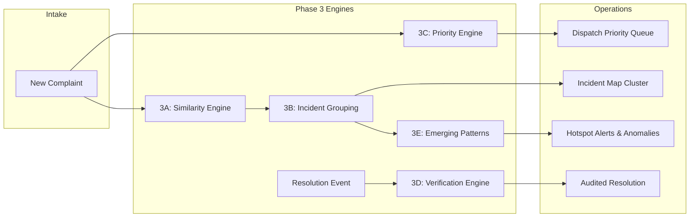
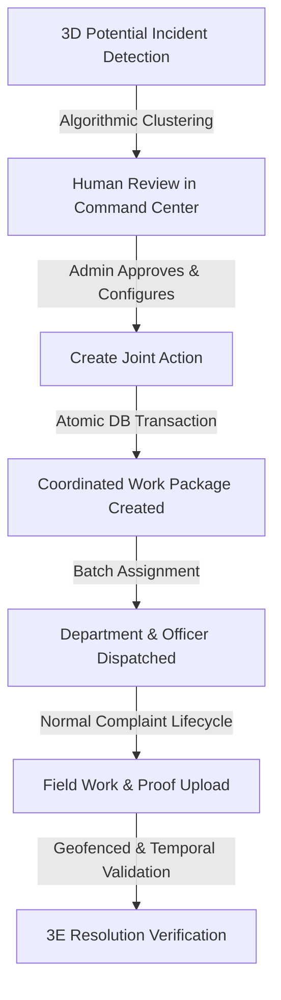
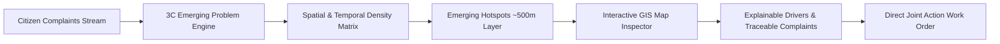
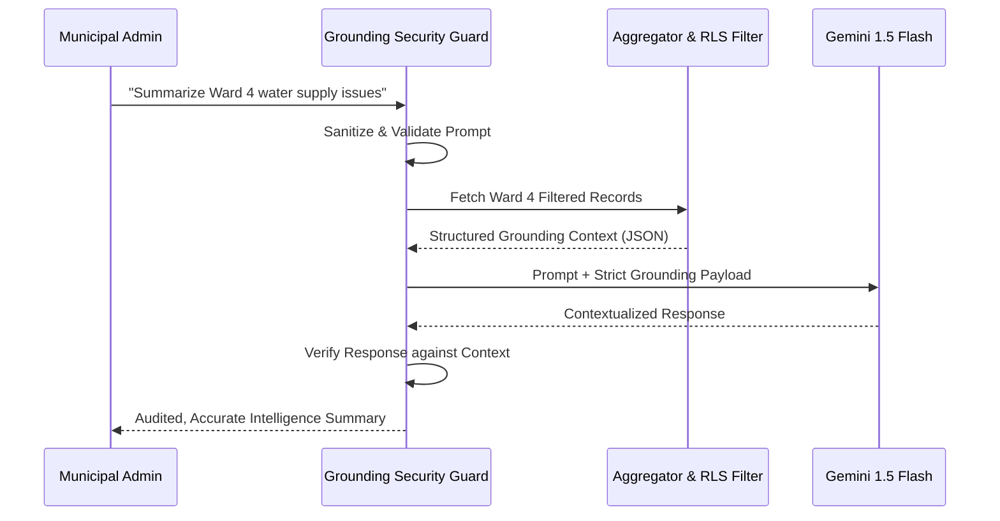

# 🧠 CivicResolve — AI & Intelligence System

> Technical documentation for CivicResolve's hybrid deterministic intelligence engines (3A–3E) and Grounded AI Copilot.

---

## Architecture: Deterministic First, Generative Second

CivicResolve strictly adheres to a **Reliable Municipal Intelligence** design philosophy:
1. **Deterministic Core (3A–3E)**: All critical governance decisions (duplicate detection, SLA prioritization, clustering, spatial hotspots) run on provably bounded mathematical algorithms that never hallucinate.
2. **Grounded AI Layer**: Large Language Models (e.g., Google Gemini 1.5 Flash) operate on strictly grounded, filtered structured data payloads with explicit grounding security guardrails.

---

## 3A–3E Intelligence Engines

---

### 3A. Semantic & Spatial Similarity Engine (`similarityEngine.ts`)
- **Spatial Distance**: Haversine formula calculation with configurable radius thresholds (e.g., 50m–200m).
- **Textual Similarity**: Token-level Jaccard similarity and character-level n-gram overlap with Solapur-localized stop-word filtering.
- **Combined Score**: Weighted blend of semantic relevance ($W_{text} = 0.5$) and geographical proximity ($W_{geo} = 0.5$).
- **Use Case**: Instantly flags matching active grievances to prevent redundant dispatches.

---

### 3B. Incident Grouping & Deduplication Engine (`incidentGroupingEngine.ts`)
- **Graph Clustering**: Groups isolated citizen submissions into unified "Root Incident" entities.
- **Parent-Child Hierarchy**: Elevates the earliest or most detailed submission to Parent status while linking subsequent reports as Child subscribers.
- **Broadcast Redressal**: Resolving the Parent incident automatically notifies all linked citizens without requiring manual duplication work by field officers.

---

### 3D Potential Incident → Joint Action Operational Workflow (`incidentGroupingEngine.ts`)

- **Detection**: 3D identifies potential relationships using spatial radius, temporal clustering, and category alignment.
- **Human Review**: Municipal administrators explicitly review potential incidents (preserving "Potential" terminology until confirmed).
- **Joint Action**: One-click coordinated operational work package creation (`incident_clusters` & `incident_cluster_reports`).
- **Data Integrity**: Preserves individual complaint records without duplication while establishing relational linkages.
- **Normal Lifecycle**: Advances pending complaints to `assigned` status; full resolution requires standard field evidence and 3E verification.

---

### 3C. Dynamic Priority Scoring Engine (`priorityEngine.ts`)
Calculates real-time priority scores ($0.0 - 100.0$) using a multi-factor formula:

$$P = w_{sev} \cdot S_{base} + w_{sla} \cdot S_{sla} + w_{pop} \cdot S_{pop} + w_{rep} \cdot S_{repeat}$$

- **Base Severity ($S_{base}$)**: Category hazard rating (e.g., Open Manhole = 95, Pothole = 60, Streetlight = 40).
- **SLA Breach Velocity ($S_{sla}$)**: Exponential escalation as time approaches statutory deadlines.
- **Population Density ($S_{pop}$)**: Multiplier based on ward population and transit corridor classification.
- **Recurrence Factor ($S_{repeat}$)**: Escalation boost if the location has experienced recurring failures within 30 days.

---

### 3D. Resolution Verification Engine (`resolutionVerificationEngine.ts`)
- **GPS Geofence Validation**: Validates that the officer's resolution photograph was taken within 100m of the original incident coordinates.
- **Temporal Verification**: Timestamp audit ensuring resolution proof cannot predate the dispatch timestamp.
- **Citizen Feedback Loop**: 72-hour citizen confirmation window. If the citizen disputes the resolution with counter-evidence, the grievance automatically re-opens at escalated priority.

---

### 3E. Emerging Problem & Pattern Detection Engine (`emergingProblemEngine.ts`)
- **Spike Detection**: Statistical volume surge scoring ($0.0 - 100.0$) comparing 24-hour recent complaint intake with baseline daily averages.
- **Spatial Hotspotting**: Geodesic clustering identifying ~500m concentration zones across specific grievance categories.
- **Explainable Driver Breakdown**: Multi-signal mathematical attribution (Volume Spike 40%, Spatial Density 25%, Category Focus 20%, Safety/Priority 15%).
- **GIS Hotspot Map Layer**: Live GIS visualization with dynamic pulsing rings, score badges, centroid inspection, and GeoJSON polygon boundaries.
- **Explainable Traceability**: Hotspots trace back to the exact list of contributing complaints, enabling operators to filter the map to the cluster or trigger immediate Joint Action workflows.

---

## Grounded AI Copilot (`copilotService.ts`)

- **Zero Hallucination Guarantee**: If the underlying query yields no records or fails authorization, the Copilot explicitly states data absence rather than extrapolating.
- **Role-Aware Scoping**: The Copilot context payload is filtered according to the caller's authorized scope (e.g., Zone Admins only receive insights for their designated zone).

---

*← Back to [README](../README.md)*
