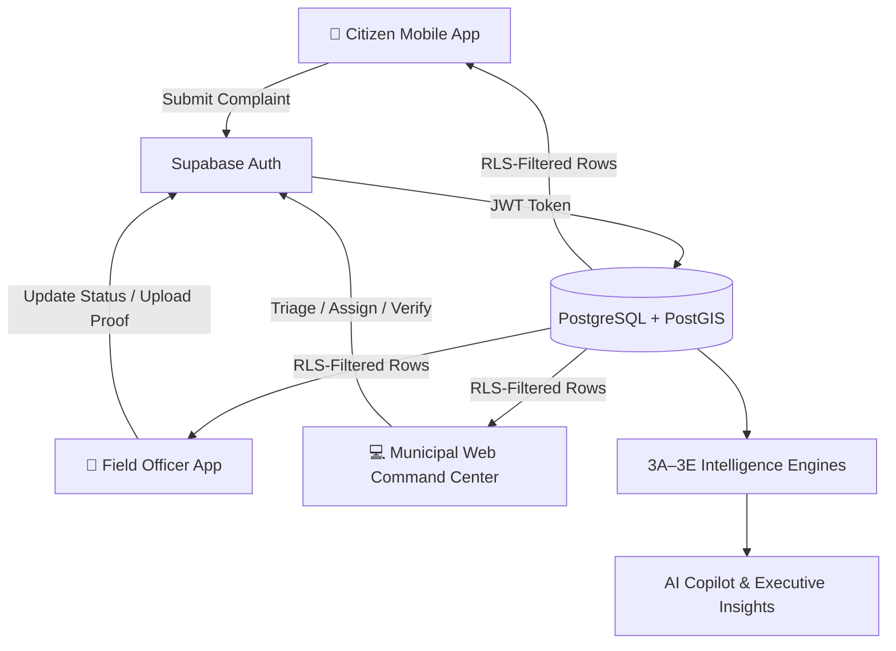

# 🏗️ CivicResolve — System Architecture

> Complete architectural reference for the CivicResolve Municipal Grievance Redressal Platform.

---

## High-Level Architecture

```
                    ┌─────────────────────────────┐
                    │         SUPABASE             │
                    │  Auth + PostgreSQL + RLS      │
                    │  Storage + Realtime           │
                    └──────────────┬───────────────┘
                                   │
                    ┌──────────────┴──────────────┐
                    │                             │
            🌐 Vercel Website              📱 Flutter APK
         Municipal Admin / Zone Ops       Citizen / Field Officer
```

Both the **React Web Command Center** and the **Flutter Mobile Client** connect to the same Supabase backend. There is no intermediate API server — Supabase Auth JWT tokens and PostgreSQL Row Level Security (RLS) enforce all authorization directly at the database level.

---

## Component Map

```
CivicResolve/
├── apps/
│   ├── mobile/                    # Flutter — Citizen & Field Officer
│   │   ├── lib/                   # Screens, services, models, widgets
│   │   ├── assets/                # App icons, SVG emblems
│   │   ├── test/                  # 98 automated tests
│   │   └── pubspec.yaml           # Flutter dependencies
│   │
│   └── web/                       # React 18 — Municipal Command Center
│       ├── src/
│       │   ├── components/        # UI: Layout, Auth, Map, Copilot, Cards
│       │   ├── context/           # AuthContext & session management
│       │   ├── hooks/             # useComplaints, useAuth
│       │   ├── pages/             # Dashboard, Complaints, LiveMap, Copilot
│       │   ├── services/          # Intelligence engines (3A–3E), AI, tests
│       │   └── types/             # TypeScript domain types
│       ├── public/                # Static assets & favicons
│       ├── vercel.json            # Vercel SPA rewrites
│       └── vite.config.ts         # Vite bundler config
│
├── supabase/
│   └── migrations/                # PostgreSQL schema, RLS policies, triggers
│
├── docs/                          # Architecture & reference documentation
├── .env.example                   # Canonical environment template
└── README.md                      # Main project documentation
```

---

## Data Flow



---

## Role-Based Interface Architecture

| Platform | Interface | Role | Purpose |
|:---------|:----------|:-----|:--------|
| 📱 Mobile | Citizen App | `citizen` | Submit complaints, track status, verify resolutions, provide feedback |
| 📱 Mobile | Field Officer App | `officer` | View assignments, navigate to GPS pin, submit resolution evidence |
| 💻 Web | Zone Operations | `dept_admin` | Manage zone-level queue, dispatch crews, monitor SLA |
| 💻 Web | Municipal Command Center | `municipal_admin` / `super_admin` | City-wide GIS, analytics, AI Copilot, verification, administration |

Authorization is enforced at the PostgreSQL level through Row Level Security (RLS), not application-level checks.

---

## Technology Stack

| Layer | Technologies |
|:------|:-------------|
| **Web Frontend** | React 18, TypeScript, Vite, TailwindCSS, Lucide Icons |
| **Mobile Client** | Flutter 3.x, Dart |
| **GIS & Mapping** | MapLibre GL (Web), MapLibre Flutter (Mobile), OpenStreetMap tiles |
| **Database & Auth** | Supabase, PostgreSQL 15, PostGIS, Supabase Auth (JWT), RLS |
| **Intelligence** | Custom TypeScript / Dart Deterministic Engines (3A–3E) |
| **AI Integration** | Google Gemini 1.5 Flash (structured REST payloads) |
| **Build & Test** | `tsc`, Vite, `tsx` test runner, `flutter_test` |

---

## Database Schema Highlights

- **`complaints`** — Core grievance table with GPS coordinates, category, status, priority, evidence, SLA
- **`incident_clusters`** — Operational joint incident clusters linking multiple related grievances into coordinated work packages
- **`incident_cluster_reports`** — Junction table mapping complaints to joint incident clusters without record duplication
- **`profiles`** — User profiles linked to Supabase Auth `auth.users`
- **`user_roles`** — Canonical role assignments (`citizen`, `officer`, `dept_admin`, `municipal_admin`, `super_admin`)
- **PostGIS** — Spatial queries for proximity, clustering, and hotspot detection
- **RLS Policies** — 30+ tested policies enforcing row-level data isolation per role
- **Triggers** — `BEFORE UPDATE` trigger preventing citizen tampering with complaint content post-submission

---

*← Back to [README](../README.md)*
