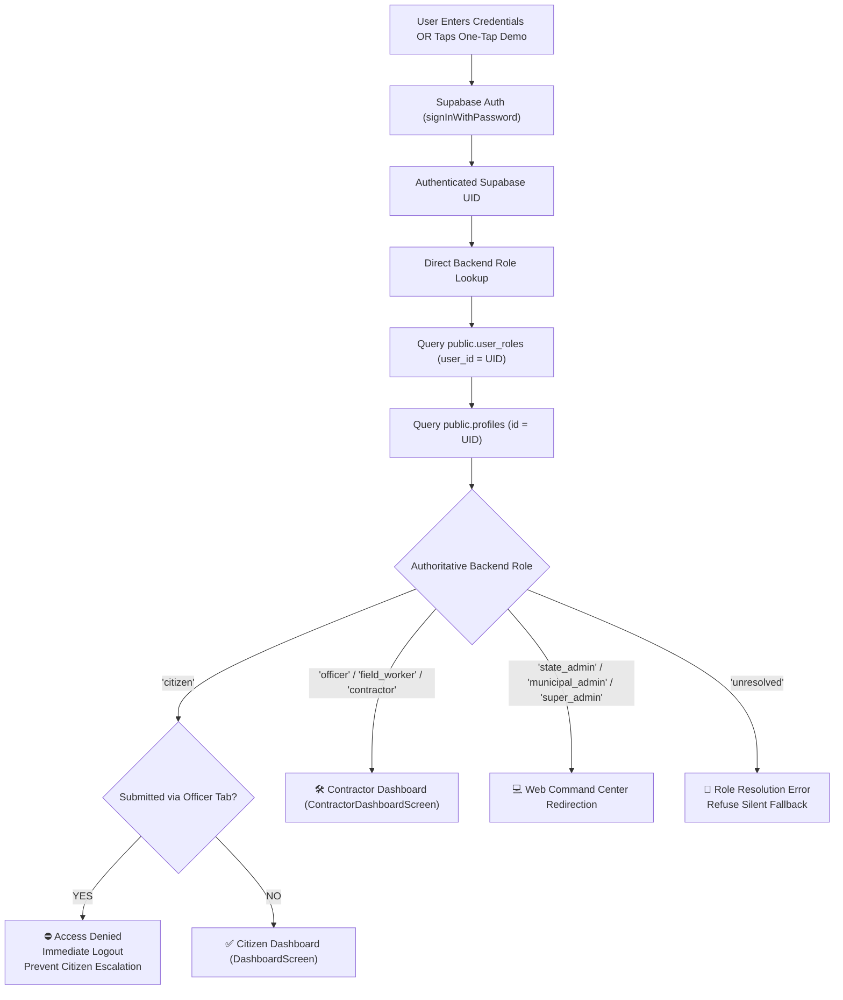
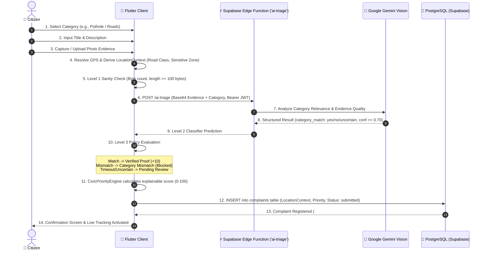
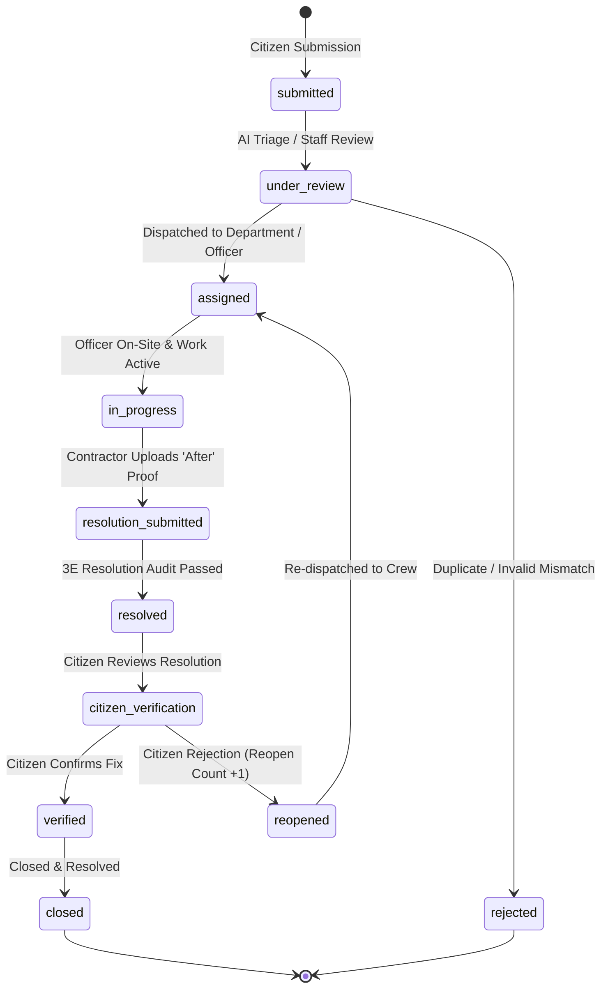

# 🏛️ CivicResolve — Final Implemented System Architecture

> **Authoritative Technical Architecture & Operational Specification**  
> CivicResolve: AI-Perception-Enabled, Deterministically Governed Municipal Grievance Redressal Platform.

---

## 1. Architectural Principles & Separation of Concerns

CivicResolve strictly enforces the three-tier architectural rule:

> **"AI for perception and unstructured evidence.  
> Deterministic engines for explainable operational decisions.  
> Backend authorization for governance and access control."**

```
                ┌──────────────────────────────────────┐
                │          1. AI PERCEPTION            │
                │                                      │
                │ • Gemini Vision Evidence Relevance   │
                │ • On-Demand Multilingual Translation │
                └──────────────────┬───────────────────┘
                                   │
                                   ▼ (Structured Signals)
                ┌──────────────────────────────────────┐
                │ 2. DETERMINISTIC CIVIC INTELLIGENCE  │
                │                                      │
                │ • 3B Explainable Priority Engine     │
                │ • GIS Location Context & Exposure    │
                │ • 3A Spatial Similarity (200m)       │
                │ • 3C Ward Category Hotspots          │
                │ • 3D Joint Incident Containers       │
                │ • 3E Resolution Audit Verification   │
                └──────────────────┬───────────────────┘
                                   │
                                   ▼ (Deterministic Decisions)
                ┌──────────────────────────────────────┐
                │        3. BACKEND AUTHORIZATION      │
                │                                      │
                │ • Supabase Auth & Authoritative Role │
                │ • PostgreSQL 15 + PostGIS            │
                │ • Row Level Security (RLS) Isolation │
                │ • Zero Client-Side Secret Exposure   │
                └──────────────────────────────────────┘
```

---

## 2. High-Level System Architecture Diagram

```mermaid
flowchart TD
    subgraph CLIENT["📱 Client Presentation Layer (Flutter Mobile Client)"]
        CitizenUser["👤 Verified Citizen"]
        OfficerUser["👷 Field Officer / Contractor"]
        
        CitizenUI["Citizen Portal\n• Grievance Submission\n• Live Track Reports\n• Localized Civic Feed"]
        OfficerUI["Contractor Portal\n• Assigned Work Queue\n• GPS Navigation\n• Resolution Proof Upload"]
        
        CitizenUser --> CitizenUI
        OfficerUser --> OfficerUI
        
        Localization["LanguageService\n(English / Hindi / Marathi)"]
        DynTranslate["DynamicTranslationService\n(On-Demand Feed Translation)"]
        Resilience["Network Resilience Layer\n(Graceful Fallback & Retry)"]
        
        CitizenUI -.-> Localization
        CitizenUI -.-> DynTranslate
        CitizenUI -.-> Resilience
    end

    subgraph AUTH["🔐 Authentication & Authoritative Role Layer"]
        SupaAuth["Supabase Auth (JWT)"]
        RoleResolver["Authoritative Role Resolution\n1. public.user_roles\n2. public.profiles\n3. Client Tab Zero-Trust"]
        
        CitizenUI -->|Sign In / Demo Citizen| SupaAuth
        OfficerUI -->|Sign In / Demo Officer| SupaAuth
        SupaAuth --> RoleResolver
        
        RoleResolver -->|role == 'citizen'| CitizenDash["Citizen Dashboard\n(DashboardScreen)"]
        RoleResolver -->|role in ['officer','field_worker','contractor']| OfficerDash["Contractor Dashboard\n(ContractorDashboardScreen)"]
        RoleResolver -->|role in ['municipal_admin','super_admin']| AdminPortalNotice["Web Command Center\n(Administrative Notice)"]
        RoleResolver -->|role == 'unresolved'| AuthError["Explicit Role Error\n(Zero Fallback)"]
    end

    subgraph AI["🧠 AI Perception Layer (Zero Client Secret Exposure)"]
        EdgeProxy["Supabase Edge Function\n'ai-triage'"]
        GeminiVision["Google Gemini Vision\n(Evidence Categorization)"]
        
        EdgeProxy --> GeminiVision
        GeminiVision -->|Structured Result| EdgeProxy
    end

    subgraph INTELLIGENCE["⚙️ Deterministic Civic Intelligence Layer (3A–3E)"]
        L1Validation["Level 1: Byte & Size Sanity"]
        L3Policy["Level 3: Conservative Policy\n• Match (>=0.70) -> Verified\n• Mismatch (>=0.70) -> Reject\n• Timeout/Uncertain -> Review"]
        
        PriorityEngine["3B Priority Engine\nScore = 0.30*Sev + 0.25*Safe\n+ 0.20*Clust + 0.15*Age + 0.10*Cat"]
        LocContext["LocationContext\n(Road Class + Sensitive Zones)"]
        SimEngine["3A Proximity Similarity (200m)"]
        HotspotEngine["3C Ward Hotspot Engine"]
        IncidentEngine["3D Joint Incident Grouping"]
        ResAuditEngine["3E Resolution Verification Audit"]
        
        LocContext --> PriorityEngine
    end

    subgraph BACKEND["💾 Backend Authority & Storage (Supabase)"]
        Postgres[(PostgreSQL 15 + PostGIS)]
        RLS["Row Level Security Policies\n(Role & UID Data Isolation)"]
        SupaStorage["Supabase Storage Buckets\n(Signed Evidence Photos)"]
        
        RLS --- Postgres
    end

    CitizenUI -->|Photo Evidence| L1Validation
    L1Validation -->|Valid Bytes| EdgeProxy
    EdgeProxy --> L3Policy
    L3Policy --> PriorityEngine
    PriorityEngine -->|Structured Report Payload| Postgres
    OfficerUI -->|Resolution Evidence| ResAuditEngine
    ResAuditEngine --> Postgres
    Postgres --> CitizenDash
    Postgres --> OfficerDash
```

---

## 3. Authentication & Authoritative Role Resolution


```mermaid
flowchart TD
    LoginInput["User Enters Credentials OR Taps One-Tap Demo"] --> SupabaseSignIn["Supabase Auth (signInWithPassword)"]
    SupabaseSignIn --> AuthUID["Authenticated Supabase UID"]
    
    AuthUID --> DBQuery["Direct Backend Role Lookup"]
    DBQuery --> QueryRoles["Query public.user_roles (user_id = UID)"]
    QueryRoles --> QueryProfiles["Query public.profiles (id = UID)"]
    
    QueryProfiles --> RoleCheck{"Authoritative Backend Role"}
    
    RoleCheck -->|'citizen'| IsOfficerTab{"Submitted via Officer Tab?"}
    IsOfficerTab -->|YES| RejectCitizen["⛔ Access Denied\nImmediate Logout\nPrevent Citizen Escalation"]
    IsOfficerTab -->|NO| RouteCitizen["✅ Citizen Dashboard (DashboardScreen)"]
    
    RoleCheck -->|'officer' / 'field_worker' / 'contractor'| RouteOfficer["🛠️ Contractor Dashboard (ContractorDashboardScreen)"]
    RoleCheck -->|'state_admin' / 'municipal_admin' / 'super_admin'| RouteAdmin["💻 Web Command Center Redirection"]
    RoleCheck -->|'unresolved'| UnresolvedError["🛑 Role Resolution Error\nRefuse Silent Fallback"]
```

### Key Security Guarantees
1. **Zero UI Role Elevation**: Selecting the "Field Officer" tab in the UI does **not** grant officer permissions. The authenticated Supabase UID's database role remains strictly authoritative.
2. **Citizen Isolation**: A citizen account attempting login through the Field Officer tab receives an explicit `Access Denied` error and is immediately signed out.
3. **Dedicated Evaluator Demo Accounts**:
   - **Citizen Demo**: `demo.citizen@civicresolve.gov` $\to$ Backend role: `'citizen'` $\to$ Citizen Dashboard.
   - **Field Officer Demo**: `demo.officer@civicresolve.gov` $\to$ Backend role: `'officer'` / `'contractor'` $\to$ Contractor Dashboard.
   - **Strict Identity Separation**: `citizen UID ≠ officer UID`.
4. **Authoritative Cold Restart**: On app restart, `AuthService.loadSavedSession()` re-queries `public.user_roles` and `public.profiles` using the authenticated UID, preventing stale local state from overriding server-side permissions.

---

## 4. Citizen Grievance Reporting Pipeline


```mermaid
sequenceDiagram
    autonumber
    actor Citizen as 👤 Citizen
    participant App as 📱 Flutter Client
    participant Edge as ⚡ Supabase Edge Function ('ai-triage')
    participant Gemini as 🧠 Google Gemini Vision
    participant DB as 💾 PostgreSQL (Supabase)

    Citizen->>App: 1. Select Category (e.g., Pothole / Roads)
    Citizen->>App: 2. Input Title & Description
    Citizen->>App: 3. Capture / Upload Photo Evidence
    App->>App: 4. Resolve GPS & Derive LocationContext (Road Class, Sensitive Zone)
    App->>App: 5. Level 1 Sanity Check (Byte count, length >= 100 bytes)
    
    App->>Edge: 6. POST /ai-triage (Base64 Evidence + Category, Bearer JWT)
    Edge->>Gemini: 7. Analyze Category Relevance & Evidence Quality
    Gemini-->>Edge: 8. Structured Result (category_match: yes/no/uncertain, conf >= 0.70)
    Edge-->>App: 9. Level 2 Classifier Prediction
    
    App->>App: 10. Level 3 Policy Evaluation:
    Note over App: Match -> Verified Proof (+10)<br/>Mismatch -> Category Mismatch (Blocked)<br/>Timeout/Uncertain -> Pending Review
    
    App->>App: 11. CivicPriorityEngine calculates explainable score (0-100)
    App->>DB: 12. INSERT into complaints table (LocationContext, Priority, Status: submitted)
    DB-->>App: 13. Complaint Registered (#CR-YYYY-XXXX)
    App-->>Citizen: 14. Confirmation Screen & Live Tracking Activated
```

---

## 5. 3-Level Photographic Evidence Validation Pipeline

```
                     [Citizen Takes / Uploads Photo]
                                    │
                                    ▼
┌────────────────────────────────────────────────────────────────────────┐
│ LEVEL 1: Local Byte & Size Sanity Check                                │
│ • Validates byte array integrity and length >= 100 bytes               │
│ • Rejects corrupt, blank, or 0-byte camera streams immediately         │
│ • Outcome: FAIL ──> Blocks submission with invalid image error         │
└───────────────────────────────────┬────────────────────────────────────┘
                                    │ PASS
                                    ▼
┌────────────────────────────────────────────────────────────────────────┐
│ LEVEL 2: Server-Side Gemini Vision Evaluation (Edge Function Proxy)   │
│ • Payload transmitted over HTTPS with authenticated Bearer JWT token   │
│ • 'ai-triage' Edge Function masks PII and queries Gemini 1.5 Flash     │
│ • Returns: category_match ("yes"|"no"|"uncertain"), confidence, reason │
│ • Zero client-side API keys or secrets stored in Flutter APK           │
└───────────────────────────────────┬────────────────────────────────────┘
                                    │
                                    ▼
┌────────────────────────────────────────────────────────────────────────┐
│ LEVEL 3: Conservative Local Decision Policy                            │
│ • MATCH ("yes" + confidence >= 0.70)   ──> 🟢 Verified Evidence Proof  │
│ • MISMATCH ("no" + confidence >= 0.70) ──> 🔴 Category Mismatch Block  │
│ • UNCERTAIN / LOW CONFIDENCE           ──> 🟡 Allowed as Under Review  │
│ • NETWORK TIMEOUT / SERVER UNAVAILABLE ──> 🟡 Allowed as Under Review  │
└────────────────────────────────────────────────────────────────────────┘
```

> **Important**: Gemini Vision functions strictly as an **AI Perception Component** (evaluating visual relevance of uploaded photos). Gemini **never** calculates final priority scores, SLAs, crew assignments, or municipal governance outcomes.

---

## 6. Deterministic Priority Engine (3B)

Priority is calculated deterministically through `CivicPriorityEngine` using 5 weighted municipal factors:

$$\text{Priority Score} = 0.30 \times S_{\text{severity}} + 0.25 \times S_{\text{safety}} + 0.20 \times S_{\text{cluster}} + 0.15 \times S_{\text{age}} + 0.10 \times S_{\text{category}}$$

```
Report Signals
      │
      ▼
┌────────────────────────────────────────────────────────────────────────┐
│ 5 Explainable Deterministic Factors (Sum of Weights = 1.00)            │
├────────────────────────────────┬────────┬──────────────────────────────┤
│ Factor                         │ Weight │ Signal Source                │
├────────────────────────────────┼────────┼──────────────────────────────┤
│ 1. Physical Severity           │  30%   │ Inherent hazard description  │
│ 2. Public Safety & Exposure    │  25%   │ LocationContext + Zone Risk  │
│ 3. Related Complaint Cluster   │  20%   │ Nearby reports (200m radius) │
│ 4. Report Age & SLA Overdue    │  15%   │ Elapsed hours since creation │
│ 5. Category Base Weight        │  10%   │ Statutory department weight  │
└────────────────────────────────┴────────┴──────────────────────────────┘
      │
      ▼
0–100 Explainable Priority Score
      │
      ├── Score >= 80.0 ──> 🔴 Critical Priority (SLA: 12-24 Hours)
      ├── Score >= 60.0 ──> 🟠 High Priority     (SLA: 24-48 Hours)
      ├── Score >= 35.0 ──> 🟡 Medium Priority   (SLA: 72 Hours)
      └── Score <  35.0 ──> 🟢 Low Priority      (SLA: 7 Days)
```

### Critical Distinction: Severity vs. Location Impact vs. Operational Priority
- **Severity**: The physical magnitude of the grievance (e.g., deep 2ft pothole vs minor road crack).
- **Location Impact**: The public exposure derived from `LocationContext` (e.g., Highway vs School Zone vs Residential Lane).
- **Operational Priority**: The synthesized, explainable 0–100 score that dictates response urgency and statutory SLA.

---

## 7. GIS Location Context Engine

`LocationContext` infers geographic infrastructure exposure without fabricating traffic counts:

| Dimension | Discrete Classification Values | Impact on Public Safety Factor |
|:---|:---|:---|
| **Road Class** | `highway`, `major_arterial`, `residential_lane`, `unknown` | High-speed corridors elevate exposure weight. |
| **Traffic Exposure** | `high`, `moderate`, `low`, `unknown` | Arterial intersections receive higher exposure scores. |
| **Sensitive Zone** | `school`, `hospital`, `transit_hub`, `none` | High-pedestrian zones apply safety multipliers. |
| **Context Source** | `reverse_geocoding`, `local_infrastructure_heuristics` | Fully transparent provenance tag on every report. |

---

## 8. Multilingual & Localization Architecture

```
User Locale Selection (English / Hindi / Marathi)
        │
        ├── 1. Global UI Localization (LanguageService)
        │      └── 100% of static labels, forms, badges, and navigation localized
        │
        ├── 2. Dynamic Content Translation (DynamicTranslationService)
        │      └── On-demand translation of citizen descriptions and comments
        │      └── Local MultilingualCivicEngine fallback when offline
        │      └── Original user-submitted text always preserved
        │
        └── 3. Database Integrity Boundary
               └── PostgreSQL enums remain strictly language-neutral (e.g., 'submitted', 'in_progress')
```

---

## 9. Network Resilience & Graceful Degradation

CivicResolve implements strict fault isolation across all external dependencies:

```
┌───────────────────────────────────────┬────────────────────────────────────────────────────────┐
│ Failure Scenario                      │ Deterministic Resilient Behavior                       │
├───────────────────────────────────────┼────────────────────────────────────────────────────────┤
│ Gemini Vision Offline / Timeout       │ Submission succeeds as 🟡 'Pending Staff Review'.       │
│                                       │ Zero fake confidence scores; user is never blocked.    │
├───────────────────────────────────────┼────────────────────────────────────────────────────────┤
│ Database Write / Network Drop         │ Submission displays explicit error banner with Retry;  │
│                                       │ Preserves all entered form data; zero fake report IDs. │
├───────────────────────────────────────┼────────────────────────────────────────────────────────┤
│ Civic Feed Unreachable               │ Displays cached local reports or connection retry UI;  │
│                                       │ No infinite blank spinners.                            │
├───────────────────────────────────────┼────────────────────────────────────────────────────────┤
│ Authentication Token Expired          │ Protected mutations safely blocked;                    │
│                                       │ Prompts clean re-authentication.                       │
└───────────────────────────────────────┴────────────────────────────────────────────────────────┘
```

---

## 10. Canonical Report Lifecycle

The report lifecycle is governed by canonical PostgreSQL enum values:


```mermaid
stateDiagram-v2
    [*] --> submitted: Citizen Submission
    submitted --> under_review: AI Triage / Staff Review
    under_review --> assigned: Dispatched to Department / Officer
    assigned --> in_progress: Officer On-Site & Work Active
    in_progress --> resolution_submitted: Contractor Uploads 'After' Proof
    resolution_submitted --> resolved: 3E Resolution Audit Passed
    resolved --> citizen_verification: Citizen Reviews Resolution
    citizen_verification --> verified: Citizen Confirms Fix
    verified --> closed: Closed & Resolved
    citizen_verification --> reopened: Citizen Rejection (Reopen Count +1)
    reopened --> assigned: Re-dispatched to Crew
    under_review --> rejected: Duplicate / Invalid Mismatch
    rejected --> [*]
    closed --> [*]
```

---

## 11. Implemented Subsystems (3A–3E Civic Intelligence)

| Subsystem | Name | Current Implementation Status | Code Location |
|:---|:---|:---|:---|
| **3A** | **Spatial Similarity & Duplicate Detection** | **Implemented** (Haversine 200m spatial proximity + token Jaccard similarity) | [`priority_engine.dart`](file:///d:/Build/CivicResolve/apps/mobile/lib/priority_engine.dart) |
| **3B** | **Explainable Priority Engine** | **Implemented** (5-Factor formula: Severity, Safety, Cluster, Age, Category) | [`priority_engine.dart`](file:///d:/Build/CivicResolve/apps/mobile/lib/priority_engine.dart) |
| **3C** | **Emerging Hotspot & Category Velocity** | **Implemented** (Ward incident density and category clustering alerts) | [`priority_engine.dart`](file:///d:/Build/CivicResolve/apps/mobile/lib/priority_engine.dart) |
| **3D** | **Joint Incident Grouping** | **Implemented** (Consolidated incident clusters linking multi-grievance infrastructure failures) | [`comprehensive_report_models.dart`](file:///d:/Build/CivicResolve/apps/mobile/lib/comprehensive_report_models.dart) |
| **3E** | **Resolution Verification & Field Audit** | **Implemented** (Contractor GPS timestamp + photo resolution proof comparison) | [`comprehensive_report_models.dart`](file:///d:/Build/CivicResolve/apps/mobile/lib/comprehensive_report_models.dart) |

---

## 12. Current Technology Stack & Responsibilities

| Layer | Component / Technology | Exact Operational Responsibility |
|:---|:---|:---|
| **Mobile Client** | Flutter 3.x / Dart | Multiplatform Citizen and Field Officer user interfaces |
| **Authentication** | Supabase Auth (JWT) | Secure token-based user authentication |
| **Authorization** | `public.user_roles`, `public.profiles`, RLS | Authoritative database-level role verification and data isolation |
| **AI Perception** | Google Gemini Vision (via Supabase Edge) | Visual evidence and category relevance evaluation |
| **Localization** | `LanguageService` + `DynamicTranslationService` | 3-Language UI localization (EN/HI/MR) + on-demand feed translation |
| **Priority Engine** | `CivicPriorityEngine` (3B) | Deterministic 0–100 explainable priority computation |
| **Location Engine** | `LocationService` + `LocationContext` | GPS coordinate resolution + infrastructure risk exposure inference |
| **Database & GIS** | PostgreSQL 15 + PostGIS | Spatial proximity queries, transactional data persistence, RLS |
| **Edge Functions** | Supabase Edge Functions (Deno/TypeScript) | PII-masked, credential-safe proxy for AI services |

---

## 13. What AI Does vs. What AI Does Not Do

### What AI Does (Perception Layer):
- Analyzes uploaded photos to determine if they match the selected grievance category.
- Evaluates photo quality, blurriness, and obstruction.
- Assumes on-demand multilingual translation of dynamic citizen comments.

### What AI Does NOT Do (Deterministic Governance):
- ❌ Does **NOT** determine the final civic priority score or urgency.
- ❌ Does **NOT** set statutory municipal SLA deadlines.
- ❌ Does **NOT** route, assign, or dispatch municipal field crews.
- ❌ Does **NOT** decide duplicate status or merge incident records.
- ❌ Does **NOT** possess administrative authority over municipal decisions.

---

*← Back to [README](../README.md)*
